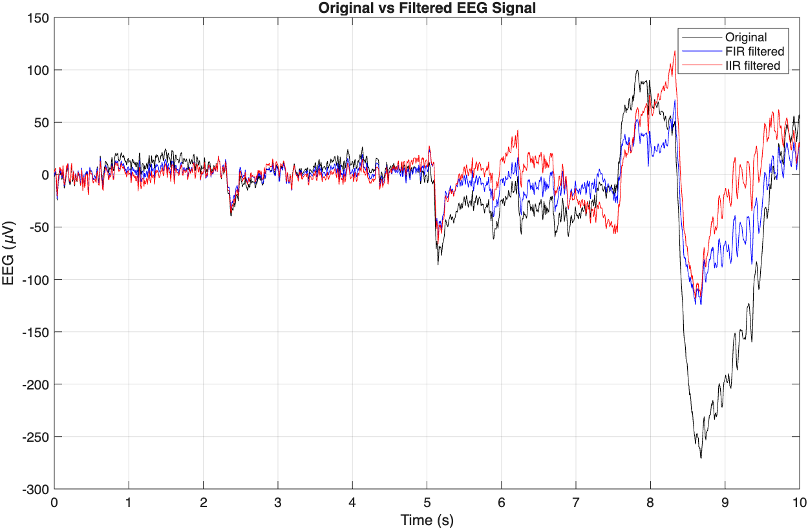
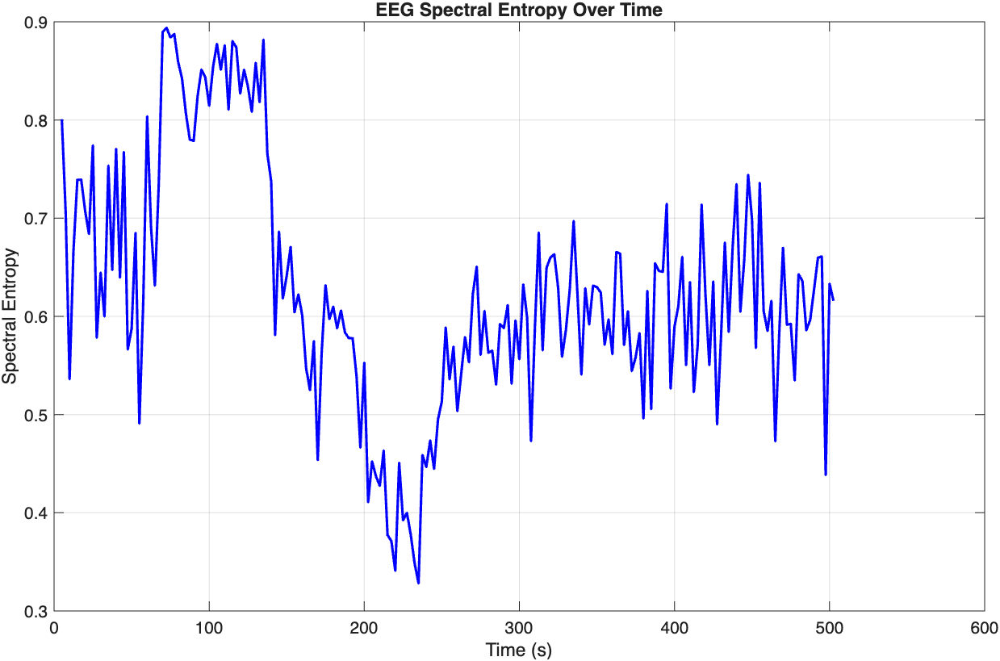
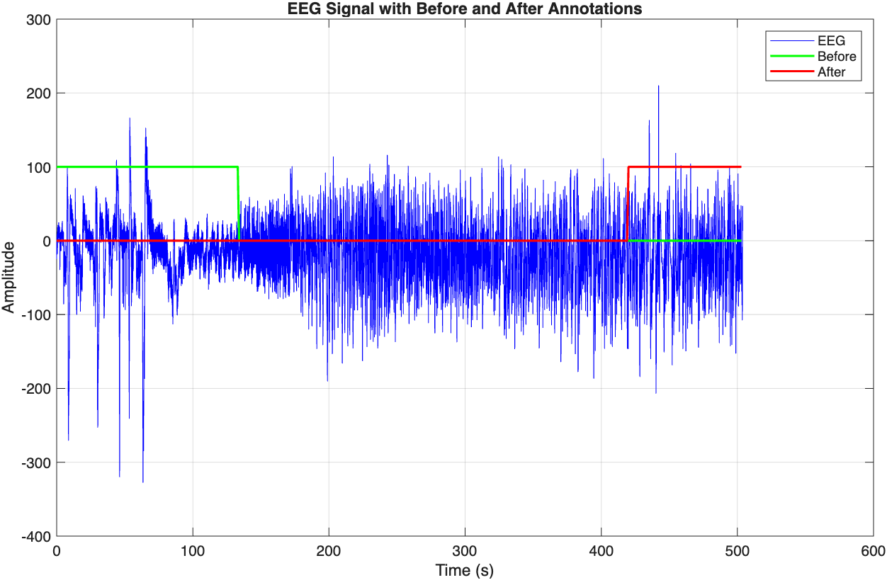
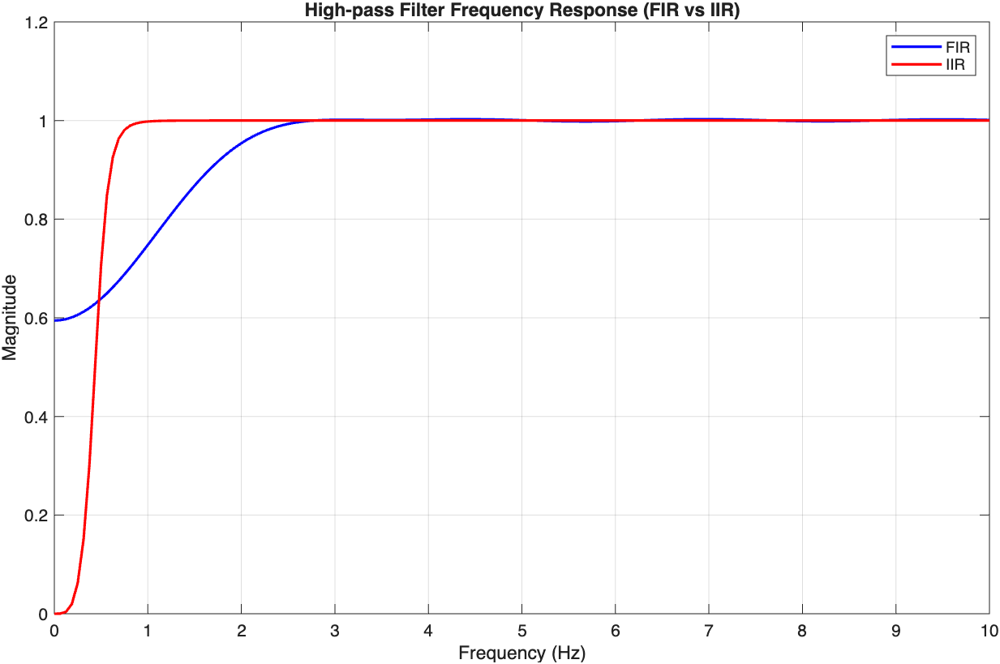

# EEG Spectral Entropy Analysis for Assessing Depth of Anesthesia

## Overview

This project implements an EEG signal processing pipeline to estimate the depth of anesthesia using **spectral entropy**,
a feature derived from power spectral density (PSD) of the EEG signal.
The computed spectral entropy is compared with **Bispectral Index (BIS)**, a commercial clinical monitor used to assess anesthesia depth.

The project was completed as part of a biosignals processing course and demonstrates core techniques in physiological signal analysis, 
digital filtering, feature extraction, and biomedical data analysis.

## Objectives

- Process raw recordings collected during anesthesia.
- Remove low-frequency movement artifacts using high-pass filter.
- Compute spectral entropy from the EEG signal.
- Compare the extracted feature with the BIS monitor.
- Evaluate spectral entropy as an indicator of anesthesia depth.

--

## Methods

The analysis consists of the following steps:

1. Visualized EEG recordings together with anesthesia annotations.
2. Estimated the EEG sampling frequency.
3. Designed and compared FIR and IIR high-pass filters.
4. Applied zero-phase filtering using 'filtfilt'.
5. Estimated the power spectral density (Welch's method).
6. Calculated normalized spectral entropy using overlapping 5-seconds windows.
7. Compared the resulting entropy values with BIS measurements.

## Results

Spectral entropy decreases during anesthesia and increases during recovery.

- The extracted feature follows the overall trend of the BIS monitor.
- FIR filtering preserved EEG morphology while effectively removing baseline drift.
- Spectral entropy provides a useful measure of EEG complexity, although it is more variable than the commercial BIS index.

### Figures

#### Original vs Filtered EEG

#### Original vs Filtered EEG

#### Spectral Entropy Over Time

#### EEG Annotations

#### Filter Frequency Response

---

## Tools

- MATLAB
- Signal Processing Toolbox
- Welch Power Spectral Density Estimation
- FIR and IIR Filtering
- Spectral Entropy
- Biomedical Signal Processing

---

## Skills 

- Physiological signal processing
- Time-series analysis
- Digital signal filtering
- Feature engineering
- Biomedical data analysis
- MATLAB programming
- Data visualization